# Spend Classification System Architecture

## Overview

The system automatically classifies accounts payable transactions into client-specific taxonomies using a multi-agent LLM pipeline. It processes raw transaction data through column mapping, supplier research, and intelligent classification to produce L1-L5 category assignments.

## System Architecture

### High-Level Flow

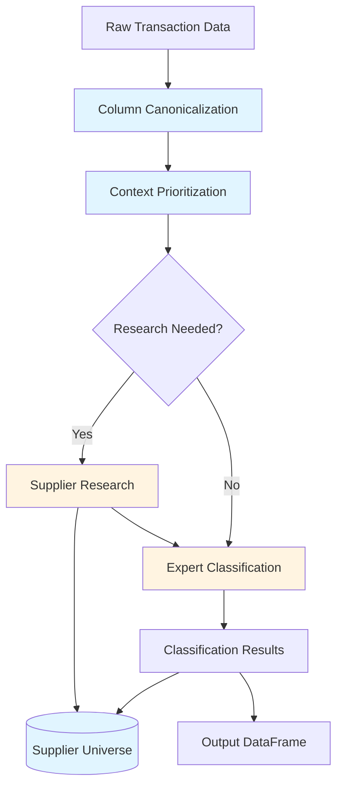

## Pipeline Components

### 1. Column Canonicalization Agent

Maps client-specific column names to a canonical schema using LLM-based pattern recognition.

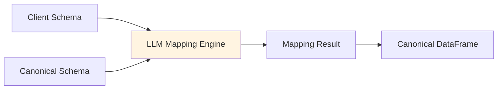

**Process**:
- Extracts column names and sample values from input data
- LLM analyzes patterns and maps to canonical columns
- Validates required fields are mapped
- Transforms data to canonical schema

**Canonical Columns**: `supplier_name`, `gl_code`, `gl_description`, `invoice_number`, `invoice_date`, `amount`, `currency`, `line_description`, `department`, `cost_center`, `po_number`

### 2. Context Prioritization Agent

Determines whether supplier research is needed and sets prioritization strategy for classification.

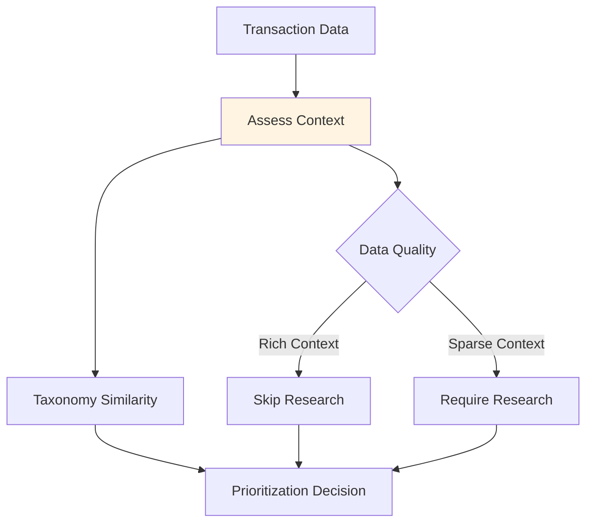

**Decision Factors**:
- Transaction data completeness (GL codes, descriptions)
- Taxonomy similarity scores via RAG
- Supplier name recognition
- Data quality indicators

**Output**: `PrioritizationDecision` with `should_research` flag and prioritization strategy

### 3. Research Agent

Gathers supplier information via web search when context is insufficient.

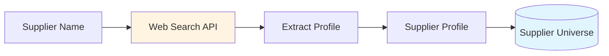

**Profile Fields**:
   - Official business name
- Industry classification
- Products and services
- Business description
   - Website URL

**Supplier Universe - Supplier Profiles**:
Supplier profiles are part of the Supplier Universe knowledge base, cached at two levels:
- **In-Memory**: Supplier profiles for current run (fast lookup)
- **Database**: Persistent supplier profile snapshots stored with classifications (reuse across runs)
- **Purpose**: Avoid re-querying web APIs for suppliers already researched
- **TTL**: Configurable via `supplier_cache_max_age_days` to invalidate stale profiles

### 4. Expert Classification Agent

Performs single-shot L1-L5 classification using taxonomy RAG and tool-augmented validation.

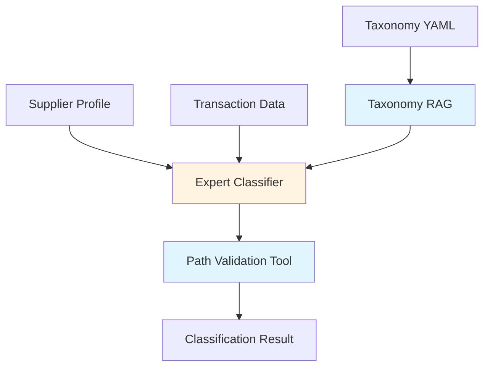

**Classification Process**:
1. **Taxonomy Retrieval**: RAG component retrieves relevant taxonomy paths using hybrid search (keyword + semantic)
2. **Context Assembly**: Formats supplier info, transaction data, and taxonomy sample
3. **LLM Classification**: Single-shot ChainOfThought prediction of full L1-L5 path
4. **Path Validation**: Tool validates path exists in taxonomy structure
5. **Result Generation**: Returns classification with confidence and reasoning

**Supplier Universe - Classification Results**:
Classification results are part of the Supplier Universe, cached at two levels:
- **In-Memory**: Current run's classification results (fast lookup within session)
- **Database**: Persistent cache with exact match on `(supplier_name, transaction_hash)` (reuse across runs)
- **Purpose**: Avoid re-classifying identical transactions
- **Storage**: Results stored with supplier profile snapshots and transaction data for audit trail

**Bottom-Up Classification Approach**:
The system uses a bottom-up matching strategy where taxonomy paths are sorted by depth (deepest/most specific first) and the LLM is instructed to match from leaf nodes (L5/L4) backward to L1. This approach:
- Prioritizes specific categories over generic ones
- Reduces ambiguity by starting with the most detailed classification level
- Improves accuracy by matching transaction details to specific taxonomy endpoints first

**Tools**:
- `validate_path`: Verifies classification path exists in taxonomy
- `lookup_paths`: Finds taxonomy paths matching criteria

### 5. Taxonomy RAG Component

Retrieves relevant taxonomy paths using hybrid search combining keyword and semantic similarity.

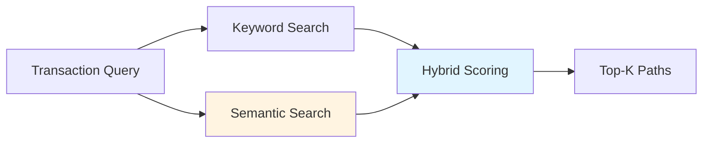

**Features**:
- FAISS vector database for semantic search
- SentenceTransformer embeddings (all-MiniLM-L6-v2)
- Multi-query RAG for better coverage
- Grouped retrieval by L1 category
- Similarity scores (0-1) for ranking

**Supplier Universe - Taxonomy Files + Embeddings**:
Taxonomy data and embeddings are part of the Supplier Universe, cached in-memory:
- **Parsed Taxonomy YAML**: Cached parsed taxonomy files to avoid re-parsing
- **FAISS Vector Indices**: Cached FAISS indices for fast semantic search
- **Taxonomy Path Embeddings**: Cached embeddings for similarity calculations
- **Purpose**: Fast taxonomy retrieval and similarity matching without repeated computation

## Data Storage

### Database Schema

The Supplier Universe uses a SQLite database for persistent storage of classification results and supplier profiles.

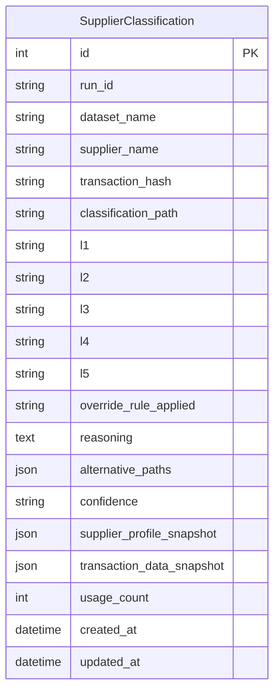

**Caching Strategy**:
- Exact match cache on `(supplier_name, transaction_hash)`
- Supplier profile snapshots stored with each classification
- Run-level isolation via `run_id`
- Transaction data snapshots for audit trail

## Taxonomy Structure

Client taxonomies stored as YAML files with hierarchical structure.

**YAML Format**:
```yaml
client_name: "Client Name"
project_id: "PROJECT_ID"
company_context:
  industry: "Industry"
  sector: "Sector"
  description: "Business description"
taxonomy:
  - "L1|L2|L3|L4|L5"
  - "L1|L2|L3"
```

**Features**:
- Flexible depth (L1-L5, configurable per client)
- Pipe-separated path format
- Company context for domain understanding
- Override rules support (future)

**Supplier Universe - Company Context**:
Company context extracted from taxonomy files is part of the Supplier Universe:
- **In-Memory**: Cached company domain context (industry, sector, business focus)
- **Purpose**: Reuse company information without re-extracting from taxonomy files
- **Source**: Extracted from `company_context` section in taxonomy YAML files

## Agent Communication

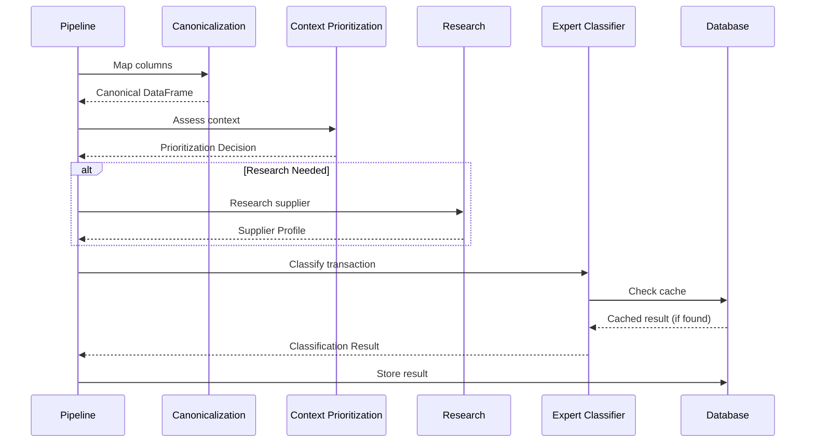

## Human-in-the-Loop Components (Not Implemented)

The system will support three human-in-the-loop intervention points to improve accuracy and allow domain experts to inject their knowledge.

### 1. Column Canonicalization Review (Not Implemented)

Allows users to review and edit auto-selected column mappings before processing.

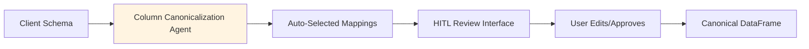

**Process**:
- Column canonicalization agent generates initial mappings
- User interface displays auto-selected column mappings with confidence scores
- User can edit, approve, or reject mappings
- Validated mappings applied to create canonical DataFrame

**Benefits**:
- Catch mapping errors before processing
- Handle edge cases and ambiguous column names
- Build trust through transparency

### 2. Dataset-Specific Rules (Not Implemented)

Enables users to add dataset-specific classification rules as documents to RAG, injected into prompts during classification.

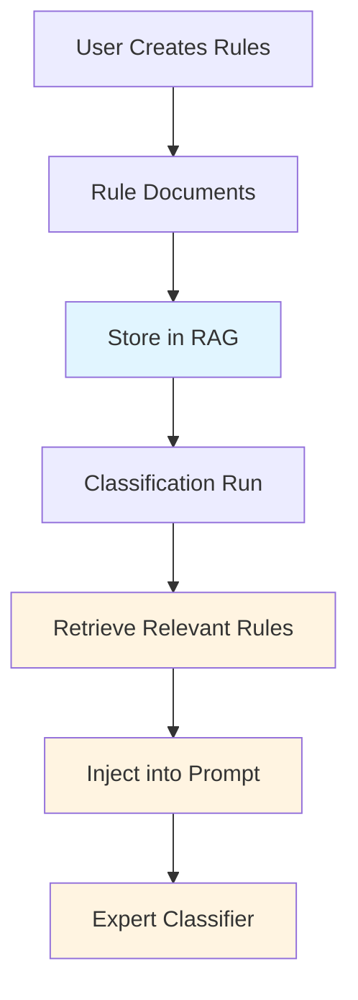

**Process**:
- User creates dataset-specific rules as natural language documents
- Rules stored in RAG system (vector database)
- Before classification run, relevant rules retrieved based on transaction context
- Rules injected into classification prompt as additional context
- LLM uses rules to guide classification decisions

**Rule Format**:
- Natural language descriptions
- Examples: "All Microsoft 365 subscriptions should be classified as IT & Technology > Software > SaaS"
- Can reference specific suppliers, GL codes, or transaction patterns

**Benefits**:
- Capture domain expert knowledge
- Handle client-specific business rules
- Improve consistency across similar transactions

### 3. Post-Classification Rule Creation (Not Implemented)

Allows users to provide natural language feedback to correct classifications, with option to persist rules for future runs.

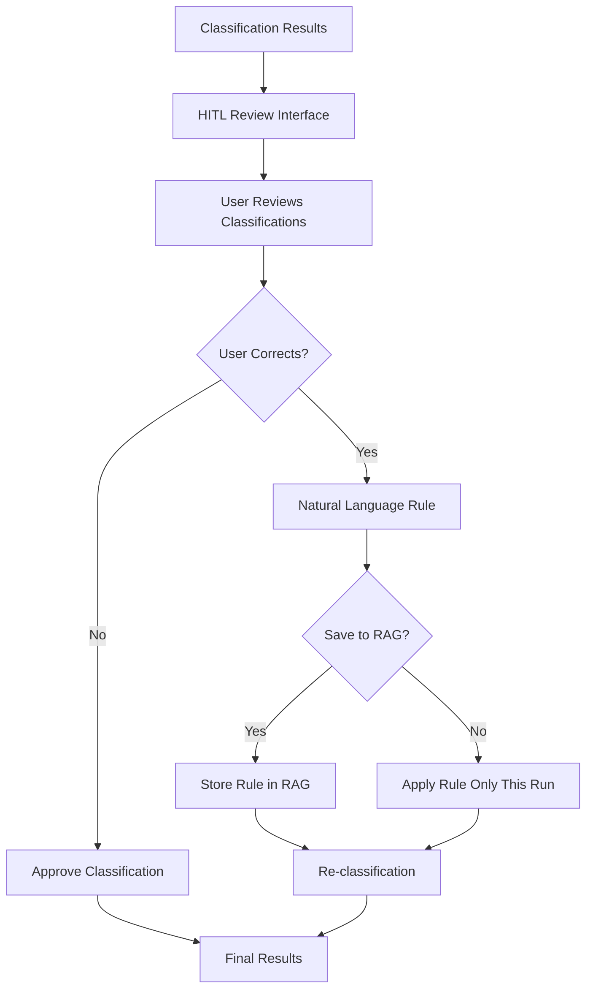

**Process**:
- After classification, user reviews results in HITL interface
- User can correct misclassifications by providing natural language rules
- Rules can be applied immediately to current batch
- Option to save rules to RAG for future runs
- Saved rules retrieved and injected in subsequent classification runs

**Rule Examples**:
- "Transactions from supplier X with GL code Y should be classified as Z"
- "All transactions containing 'cloud' in description should be IT & Technology > Cloud Services"
- "Supplier ABC's consulting services should be Professional Services, not IT"

**Benefits**:
- Continuous improvement through feedback
- Learn from corrections
- Reduce repeated errors
- Build institutional knowledge

## Configuration

**LLM Providers**: OpenAI, Anthropic (configurable per agent)

**Search Provider**: Exa API for supplier research

**Tracing**: MLflow integration for observability

**Supplier Universe**: Optional database caching for classifications and supplier profiles (enabled via `ENABLE_CLASSIFICATION_CACHE`)

## Output

**DataFrame Columns**:
- Original client columns (preserved)
- Canonical columns (mapped)
- Classification: `L1`, `L2`, `L3`, `L4`, `L5`
- Metadata: `override_rule_applied`, `reasoning`, `error`

**Intermediate Results** (optional):
- Column mapping result
- Supplier profiles dictionary
- Run ID for tracking
