# Agentic Spend Classification System Architecture

## Overview

The agentic spend classification system processes accounts payable (AP) data through several stages to automatically categorize spend transactions. It begins by extracting and standardizing AP datasets from ERP systems, focusing on key fields like supplier names, GL codes/descriptions, and invoice/PO details. The system first attempts to match supplier names against a known supplier universe to find existing spend categorizations, which are then mapped to client-specific taxonomies.

For suppliers without existing categorizations, the system employs a LLM workflow. The LLM analyzes the supplier name, GL information, and transaction descriptions to predict appropriate spend categories, optionally performing web searches for additional context. Each prediction receives a confidence score - high confidence matches are automatically applied while low confidence ones are routed for human review.

Human reviewers can verify and correct the LLM's classifications through either natural language interaction or a UI interface. All newly validated supplier-category mappings, whether from the LLM or human review, are added back to the supplier universe to improve future matching accuracy.

## System Architecture

### High-Level Architecture Diagram

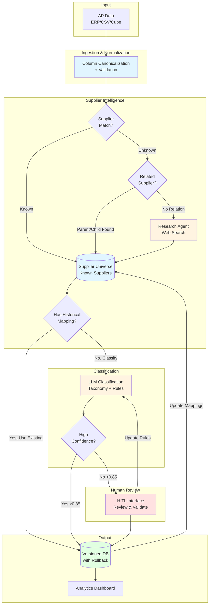

## Component Details

### 1. Column Canonicalization Module

**Purpose**: Standardizes diverse AP data formats into a unified canonical schema for downstream processing.

#### Matching Algorithm
The canonicalization algorithm uses an LLM to intelligently map client data schema columns to canonical columns.

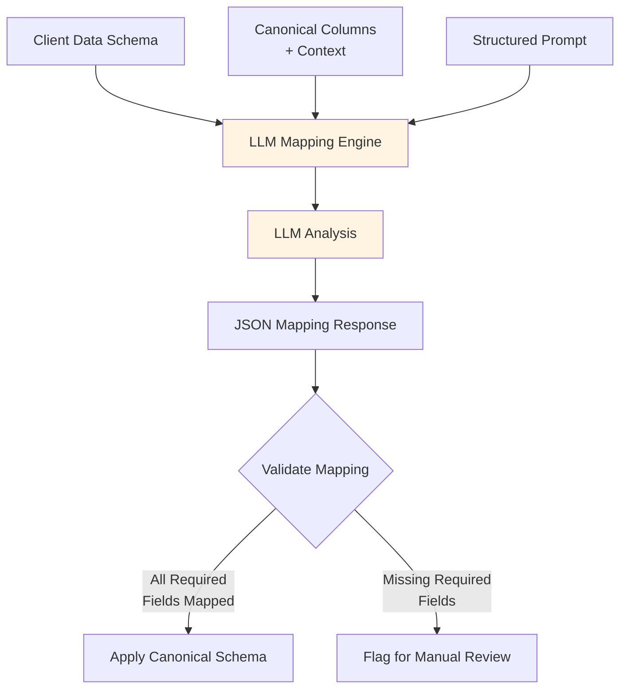

**Database Schema**:

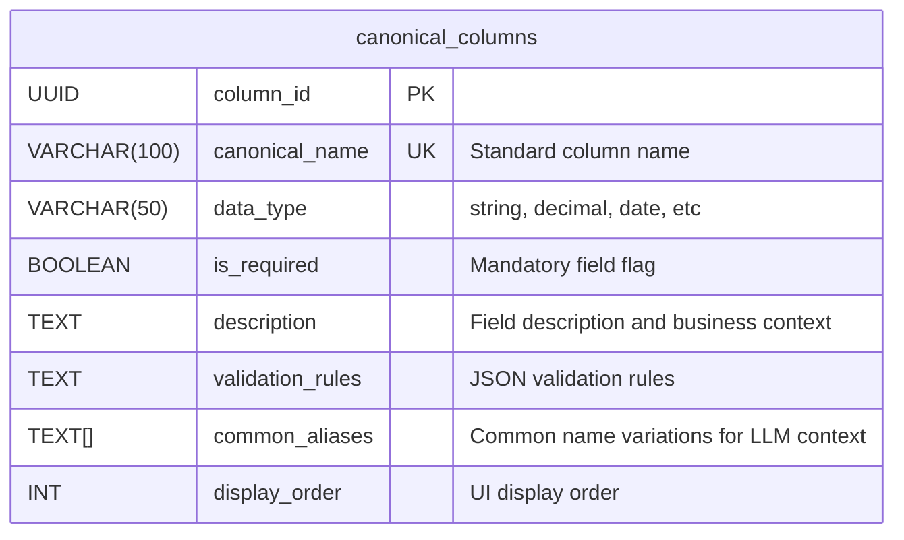

**Table Descriptions**:

#### Canonical Columns Table

Master table defining the standard column schema that guides LLM-based column mapping.

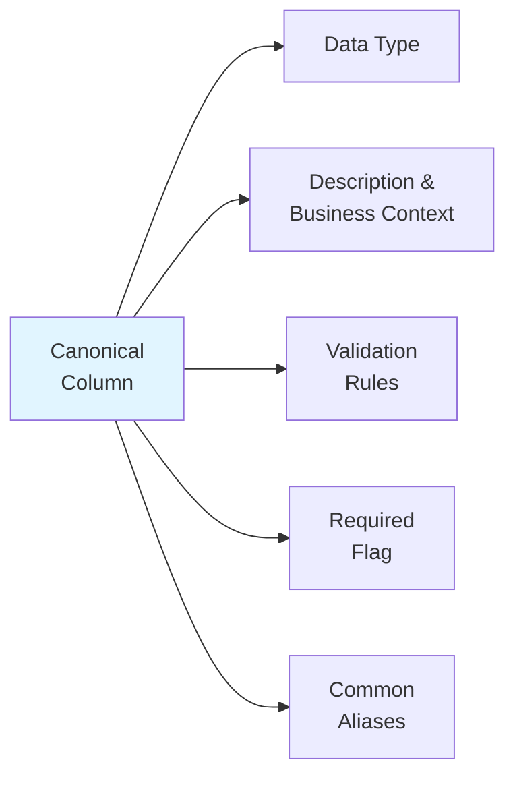

**Key Fields**:
- `canonical_name`: Standard column name used throughout the system (e.g., "supplier_name")
- `description`: Business context and meaning of the field to guide LLM understanding
- `data_type`: Expected data type for validation
- `is_required`: Whether this field must be present in source data
- `validation_rules`: JSON containing validation logic (regex, range, format)
- `common_aliases`: Array of common variations provided as context to the LLM (e.g., ["Vendor Name", "Supplier Name", "Payee"])

**Standard Canonical Columns**:
- `supplier_name` (string, required)
- `supplier_id` (string, optional)
- `gl_code` (string, required)
- `gl_description` (string, optional)
- `invoice_number` (string, required)
- `invoice_date` (date, required)
- `po_number` (string, optional)
- `line_description` (string, optional)
- `amount` (decimal, required)
- `currency` (string, required)
- `department` (string, optional)
- `cost_center` (string, optional)


**Processing Logic**:
1. **Load Canonical Schema**: Retrieve canonical columns with descriptions, aliases, and data types from database
2. **Extract Client Schema**: Analyze incoming data to extract column names and sample values
3. **Prepare LLM Prompt**: Construct structured prompt containing:
   - List of canonical columns with descriptions and common aliases
   - Client data schema (column names and sample values)
   - Instructions to return JSON mapping
4. **LLM Inference**: Send prompt to LLM (GPT-4/Claude) requesting JSON mapping of canonical_name → client_column_name
5. **Parse Response**: Extract JSON mapping from LLM response
6. **Validation**: 
   - Verify all required canonical columns are mapped
   - Check that mapped client columns exist in source data
   - Flag unmapped required fields for manual review
7. **Apply Mapping**: Transform client data using the mapping to produce standardized output with canonical column names

**Example LLM Mapping**:

**Input to LLM**:
```json
{
  "canonical_columns": [
    {
      "name": "supplier_name",
      "description": "Name of the vendor/supplier",
      "data_type": "string",
      "required": true,
      "common_aliases": ["Vendor Name", "Supplier Name", "Payee"]
    },
    {
      "name": "gl_code",
      "description": "General ledger account code",
      "data_type": "string",
      "required": true,
      "common_aliases": ["GL Account", "Account Code", "GL Code"]
    },
    {
      "name": "amount",
      "description": "Transaction amount",
      "data_type": "decimal",
      "required": true,
      "common_aliases": ["Total", "Amount", "Cost", "Price"]
    }
  ],
  "client_schema": [
    {"column_name": "Vndr Nm", "sample_values": ["Acme Corp", "ABC Supplies"]},
    {"column_name": "GL Account Code", "sample_values": ["4000-100", "5200-025"]},
    {"column_name": "Total Cost", "sample_values": ["1250.50", "850.00"]},
    {"column_name": "Inv Date", "sample_values": ["2023-01-15", "2023-01-20"]}
  ]
}
```

**LLM Response**:
```json
{
  "mappings": {
    "supplier_name": "Vndr Nm",
    "gl_code": "GL Account Code",
    "amount": "Total Cost",
    "invoice_date": "Inv Date"
  },
  "confidence": "high",
  "unmapped_client_columns": [],
  "unmapped_canonical_columns": []
}
```

**Reasoning**: The LLM recognizes "Vndr Nm" as an abbreviation of "Vendor Name", "GL Account Code" as a direct match to the gl_code aliases, and "Total Cost" as corresponding to the amount field based on the sample numeric values and common alias "Cost".


### 2. Guardrails Module

**Purpose**: Validates data quality and enforces business rules before classification.

**Validation Checks**:

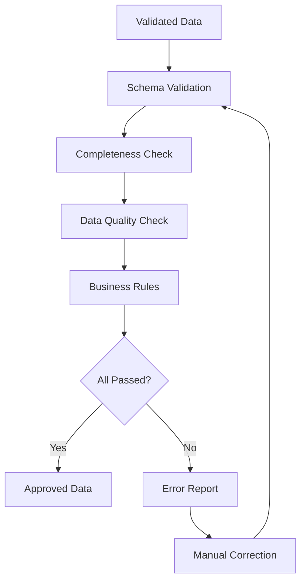

**Check Categories**:

1. **Schema Validation**
   - All required columns present
   - Data types match schema
   - No malformed data

2. **Completeness Checks**
   - Null value percentage < threshold (default: 5%)
   - Missing supplier names < 1%
   - Missing amounts = 0%

**Output**:
- Validation report (JSON)
- Passed transactions (CSV)
- Failed transactions with error codes (CSV)
- Data quality metrics (JSON)


### 3. Supplier Universe Database

**Purpose**: Maintains a curated database of known suppliers with their historical categorizations, enabling rapid matching and consistent classification across projects.

#### Database Schema

The Supplier Universe consists of two interconnected tables:

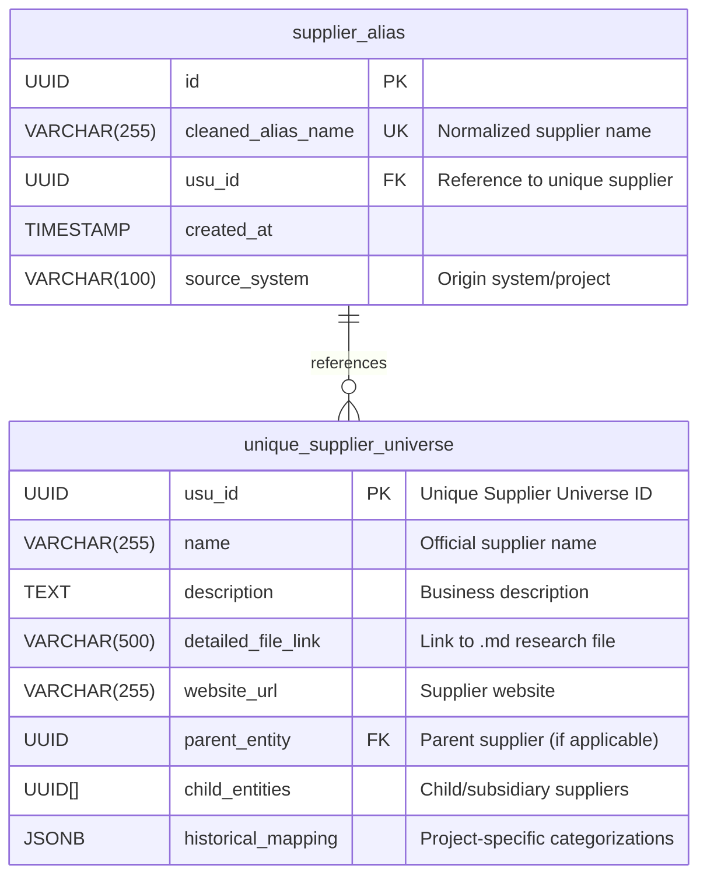

#### Table Descriptions

**Supplier Alias Table**:
- **Purpose**: Stores normalized variations of supplier names for efficient matching
- **Key Fields**:
  - `cleaned_alias_name`: Supplier name normalized (lowercase, no punctuation/spaces)
  - `usu_id`: Foreign key linking to the canonical supplier in unique_supplier_universe
  - `source_system`: Tracks which project/system introduced this alias

**Unique Supplier Universe Table**:
- **Purpose**: Master record for each unique supplier with rich context and historical data
- **Key Fields**:
  - `usu_id`: Primary key, unique identifier for each supplier
  - `name`: Official/canonical name of the supplier
  - `description`: Business context about the supplier
  - `detailed_file_link`: Path to markdown file with comprehensive research
  - `website_url`: Official supplier website for verification
  - `parent_entity`: Self-reference to another supplier that is the parent company
  - `child_entities`: Array of usu_ids for subsidiaries/child companies
  - `historical_mapping`: JSON structure storing categorizations by project/cube


#### Supplier Matching Algorithm

When new client data arrives, the system performs intelligent supplier matching:

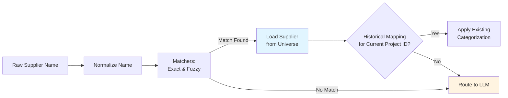

#### Normalization Process

**Step 1: Clean Supplier Name**
```
"Acme Corp."          → "acmecorp"
"ABC Supplies, Inc."  → "abcsuppliesinc"
"Smith & Sons LLC"    → "smithsonssllc"
"O'Reilly Media"      → "oreillymedia"
```

**Step 2: Keyword Matching**
- Direct lookup in `supplier_alias.cleaned_alias_name`
- Uses database index for O(1) lookup
- Returns exact matches immediately

**Step 3: Fuzzy Matching**
- Applied if no exact match found
- Uses Levenshtein distance or similar algorithm
- Threshold typically set to 85-90% similarity
- Returns candidates with similarity scores

**Step 4: Parent/Subsidiary Detection** (if Steps 2-3 fail)
- Detects relationships between new supplier and existing suppliers in universe
- Uses multi-layered approach: token extraction, partial matching, and LLM-based detection
- Identifies subsidiaries, parent companies, legal entities, and aliases
- See detailed subsection below

**Step 5: Extract Taxonomy Mapping from Historical Data**
- Once supplier is matched (via exact or fuzzy matching), retrieve `historical_mapping` JSON from `unique_supplier_universe` table
- Check if current project/cube ID exists as a key in the `historical_mapping`
- If found, extract the full L1-L5 categorization for the current project
- If not found for current project, route to LLM for new categorization

#### Parent/Subsidiary Detection

**Purpose**: When exact and fuzzy matching fail, detect if the unknown supplier is related to an existing supplier (subsidiary, parent, legal entity variant, or alias).

This component prevents creating duplicate entries for related suppliers and leverages existing supplier knowledge.

**Common Scenarios**:
- **Subsidiaries**: "Amazon Japan", "Amazon Web Services" → "Amazon"
- **Parent Companies**: "YouTube LLC" → "Google LLC"
- **Legal Entity Variants**: "Microsoft Ireland Operations Limited" → "Microsoft Corporation"
- **Rebrands/Aliases**: "Facebook, Inc." → "Meta Platforms Inc"
- **Regional Variants**: "Coca-Cola European Partners" → "Coca-Cola Company"

**Why Standard Fuzzy Matching Fails**:
- "amazonjapan" vs "amazon" = 75% similarity (might pass, but risky)
- "youtube" vs "google" = 0% similarity (completely different)
- "whatsapp" vs "meta" = 0% similarity (no lexical overlap)
- Creates false positives with high thresholds, misses relationships with low thresholds

**Detection Algorithm**:

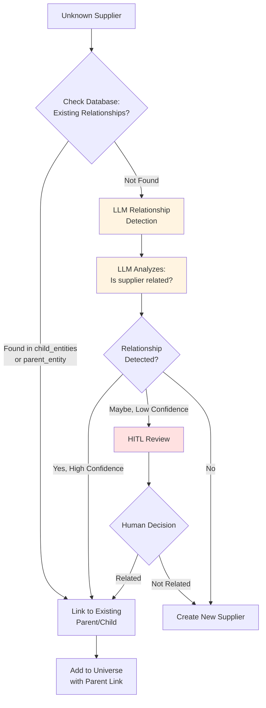

**Step 1: Check Existing Relationships in Database**

First, query the database to see if this supplier name already appears as a child or parent in existing records. If found, use the existing relationship immediately.

**Step 2: LLM-Based Relationship Detection**

If no existing relationship found, use LLM to detect semantic relationships.

**Step 3: HITL Review for Ambiguous Cases**

When LLM confidence is moderate (0.60-0.85), route to human review to confirm relationship.

**Database Updates After Detection**

When relationship is confirmed add new supplier to universe and add parent's children array.

**Inheritance of Classifications**

Once parent-child relationship is established, child suppliers can inherit parent's categorizations:

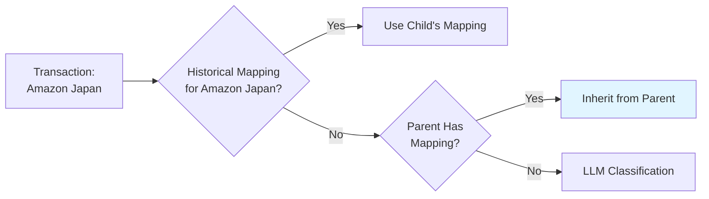


### 4. Agentic Classification Engine

**Purpose**: Intelligently classifies unknown suppliers using web research and LLM-based categorization with client-specific taxonomies.

The classification engine operates in two stages: supplier research and taxonomy classification.

#### Stage 1: Supplier Research Agent

When an unknown supplier is encountered (no match in Supplier Universe), a research agent gathers contextual information.

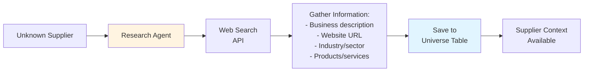

**Research Agent Tasks**:
1. **Web Search**: Query search engines for supplier information
2. **Data Extraction**: Extract key facts about the supplier:
   - Official business name
   - Company description
   - Website URL
   - Industry classification
   - Products and services offered
   - Parent company (if applicable)
3. **Create Detailed File**: Generate markdown file with comprehensive research and save link to `detailed_file_link`
4. **Populate Universe Table**: Insert new entry into `unique_supplier_universe` with all gathered information
5. **Skip Historical Mapping**: Do NOT populate `historical_mapping` at this stage

**Output**: New supplier entry in universe table with rich context, ready for classification.

#### Stage 2: LLM Taxonomy Classification

Once supplier context is available, the LLM classifies the supplier using client-specific taxonomy, override rules, and AP transaction data.

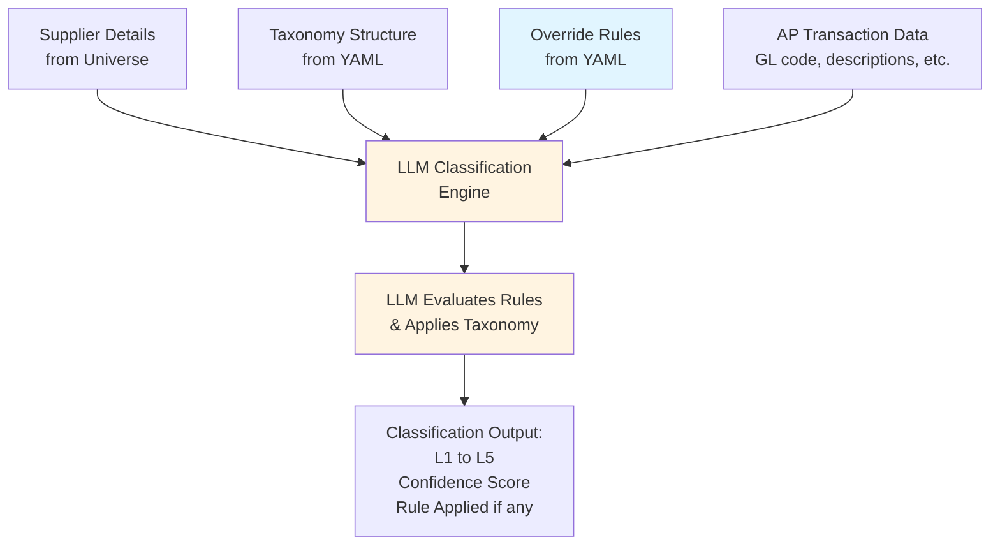

#### Client Taxonomy Storage

Each client's taxonomy is stored as a dedicated YAML file containing the full hierarchical structure and client-specific override rules as separate sections.

**File Structure**: `taxonomies/{client_name}_taxonomy.yaml`

**Example YAML Structure**:
```yaml
client_name: "FOX Corporation"
project_id: "FOX_20230816_161348"

taxonomy:
  - L1: "Marketing & Advertising"
    description: "All marketing, advertising, and promotional spend"
    
    children:
      - L2: "Digital Marketing"
        description: "Online and digital advertising channels"
        
        children:
          - L3: "Social Media Management"
            description: "Social media platform advertising and management"
            
            children:
              - L4: "Paid Social"
                description: "Paid advertising on social platforms"
                
                children:
                  - L5: "Campaign Management"
                    description: "Campaign setup, monitoring, and optimization"
                  - L5: "Ad Creative Services"
                    description: "Creative design for social ads"
              
              - L4: "Organic Social"
                description: "Non-paid social media management"

  - L1: "IT & Technology"
    description: "Technology products, services, and software"
    
    children:
      - L2: "Software"
        description: "Software products and subscriptions"
        
        children:
          - L3: "SaaS Subscriptions"
            description: "Software as a Service subscriptions"
            
            children:
              - L4: "Productivity Software"
                description: "Business productivity tools"
                
                children:
                  - L5: "Office Suite"
                    description: "Office productivity applications"
                  - L5: "Collaboration Tools"
                    description: "Team collaboration platforms"

override_rules:
  - "When the supplier is Amazon, AWS, or Amazon Web Services, and the GL description contains keywords like 'cloud', 'hosting', 'infrastructure', or 'compute', classify the transaction under: L1: IT & Technology > L2: Cloud Services > L3: Infrastructure as a Service > L4: Compute Services > L5: Virtual Machines"
  
  - "All Microsoft 365 or Office 365 subscriptions (including O365, M365 variants) from Microsoft Corporation should be classified as: L1: IT & Technology > L2: Software > L3: SaaS Subscriptions > L4: Productivity Software > L5: Office Suite"
  
  - "Google Ads, Facebook Ads, LinkedIn Ads, and similar social media advertising platforms should always be categorized as: L1: Marketing & Advertising > L2: Digital Marketing > L3: Social Media Management > L4: Paid Social > L5: Campaign Management"
```


**LLM Input Structure**:
```json
{
  "supplier": {
    "name": "Meta Platforms Inc",
    "description": "Social media and technology company providing advertising platforms",
    "website": "https://www.meta.com",
    "industry": "Technology / Social Media"
  },
  "transaction_data": {
    "gl_code": "6200-150",
    "gl_description": "Marketing - Digital Advertising",
    "line_description": "Facebook Ads Campaign - Q1 2024",
    "amount": 25000.00,
    "invoice_number": "INV-2024-001"
  },
  "client_taxonomy": {
    "taxonomy_structure": "...full YAML taxonomy hierarchy L1-L5 with descriptions..."
  },
  "override_rules": [
    "When the supplier is Amazon, AWS, or Amazon Web Services, and the GL description contains keywords like 'cloud', 'hosting', 'infrastructure', or 'compute', classify the transaction under: L1: IT & Technology > L2: Cloud Services...",
    "All Microsoft 365 or Office 365 subscriptions from Microsoft Corporation should be classified as: L1: IT & Technology > L2: Software > L3: SaaS Subscriptions...",
    "Google Ads, Facebook Ads, LinkedIn Ads should always be categorized as: L1: Marketing & Advertising > L2: Digital Marketing..."
  ]
}
```

**LLM Output Structure**:
```json
{
  "classification": {
    "L1": "Marketing & Advertising",
    "L2": "Digital Marketing",
    "L3": "Social Media Management",
    "L4": "Paid Social",
    "L5": "Campaign Management"
  },
  "confidence_score": 0.95,
  "override_rule_applied": "OR-004",
  "reasoning": "Applied override rule OR-004: Google Ads, Facebook Ads, LinkedIn Ads should always be categorized as Marketing & Advertising > Digital Marketing > Social Media Management > Paid Social > Campaign Management. The transaction is for Facebook Ads campaigns, which directly matches this rule. Meta Platforms is a social media company and the GL code 6200-150 indicates digital advertising spend.",
  "alternative_classifications": [
    {
      "classification": {
        "L1": "Marketing & Advertising",
        "L2": "Digital Marketing",
        "L3": "Social Media Management",
        "L4": "Paid Social",
        "L5": "Ad Creative Services"
      },
      "confidence_score": 0.65,
      "reasoning": "Could involve creative services if campaign includes design work"
    }
  ]
}
```

**Historical Mapping Update Logic**:
- **High Confidence (≥ 0.85)**: Automatically update `historical_mapping` in supplier universe table
- **Medium/Low Confidence (< 0.85)**: Route to HITL review, update mapping only after human validation

#### Override Rules

**Purpose**: Capture expert knowledge and handle edge cases through natural language rules that guide LLM classification decisions.

Override rules are stored as natural language text in the `override_rules` section of the client's YAML taxonomy file (see example above). These rules are provided to the LLM as additional context during classification.


**Rule Sources**:
- **Predefined**: Created by system administrators based on known patterns
- **Client-Provided**: Specific business rules from client domain experts
- **HITL-Generated**: Created by human reviewers during classification review (see HITL section)
- **Batch Import**: Imported from previous projects or client requirements


### 5. Human-in-the-Loop (HITL) System

**Purpose**: Ensures data quality and classification accuracy through strategic human intervention at critical decision points.

The HITL system provides three intervention points to maintain classification quality and handle edge cases.

#### HITL Architecture Overview

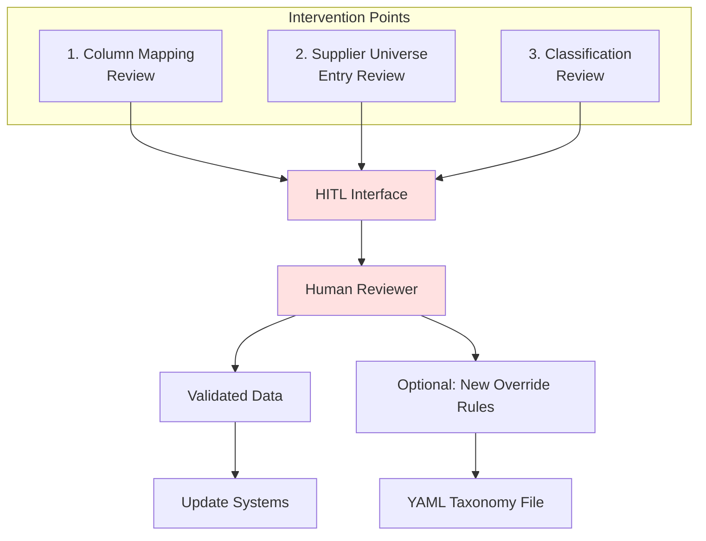

#### Intervention Point 1: Column Mapping Review

**Trigger**: LLM-based column canonicalization produces ambiguous or low-confidence mappings.

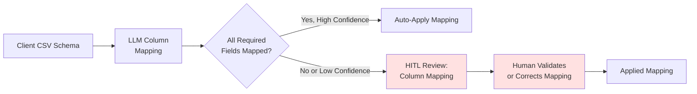

**Review Interface Shows**:
- Client column names with sample values
- LLM's proposed canonical mapping
- Confidence scores for each mapping
- Unmapped columns (client or canonical)

**Human Actions**:
- Approve LLM mapping
- Correct incorrect mappings
- Map unmapped columns manually
- Flag columns for exclusion

**Output**: Validated column mapping for data transformation

---

#### Intervention Point 2: Supplier Universe Entry Review

**Trigger**: Research agent creates new supplier entry based on web search results.

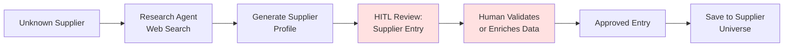

**Review Interface Shows**:
- Supplier name (raw and normalized)
- AI-generated description
- Website URL
- Industry classification
- Source links from web search
- Suggested parent entity (if detected)

**Human Actions**:
- Approve AI-generated profile
- Edit description for accuracy
- Correct website URL
- Verify or set parent entity relationships
- Add additional context
- Link to existing supplier (if duplicate)

**Output**: High-quality supplier entry in universe database

---

#### Intervention Point 3: Classification Review

**Trigger**: LLM classification produces medium or low confidence scores.

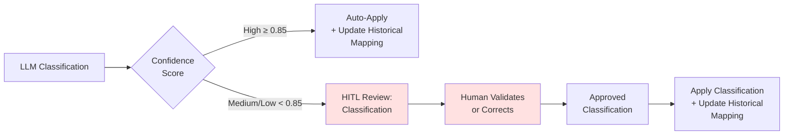

**Review Interface Shows**:
- Supplier name and context (from universe)
- Transaction details (GL code, description, amount)
- LLM's proposed L1-L5 classification
- Confidence score and reasoning
- Alternative classifications (if any)
- Client taxonomy structure for reference

**Human Actions**:
- Approve LLM classification
- Select alternative classification
- Manually select correct L1-L5 path
- Create override rule for similar cases
- Add notes for future reference

**Output**: 
- Validated classification applied to transactions
- `historical_mapping` updated in supplier universe table
- Optional: New override rule created (added to client's YAML taxonomy file)


### 6. Output Layer with Version Control

**Purpose**: Store categorized transactions with full version control capabilities, enabling rollback and audit trail management similar to git.

#### Versioned Transaction Database

The output layer maintains a complete history of all classification changes, allowing users to track, audit, and rollback data modifications.

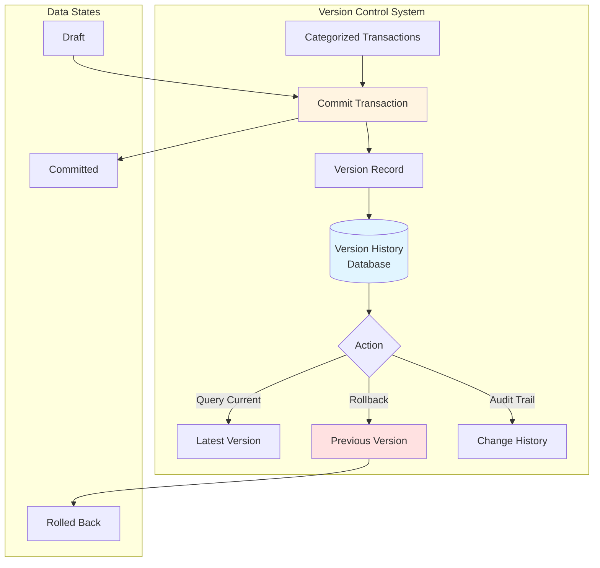

#### Database Schema

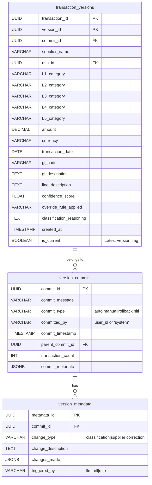


